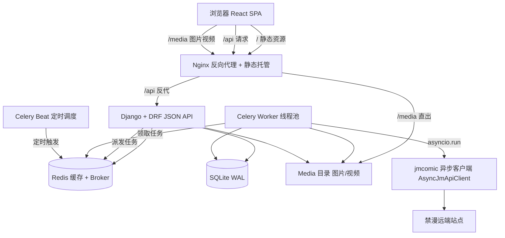
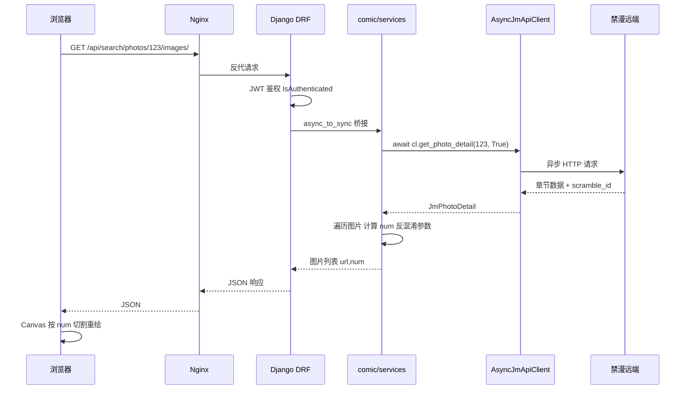
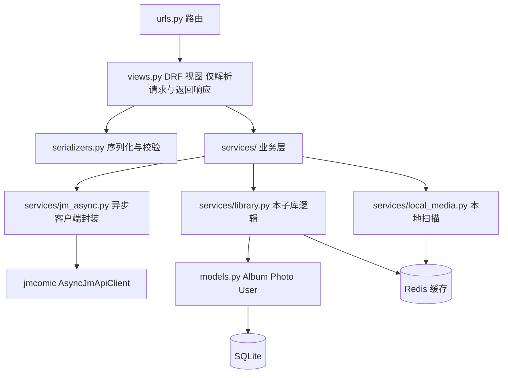
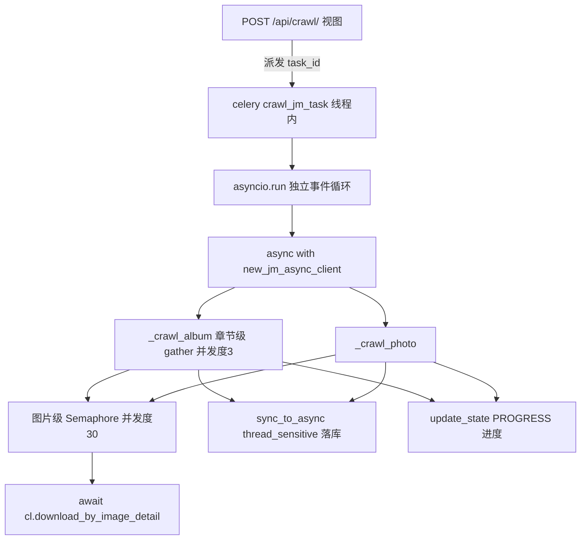
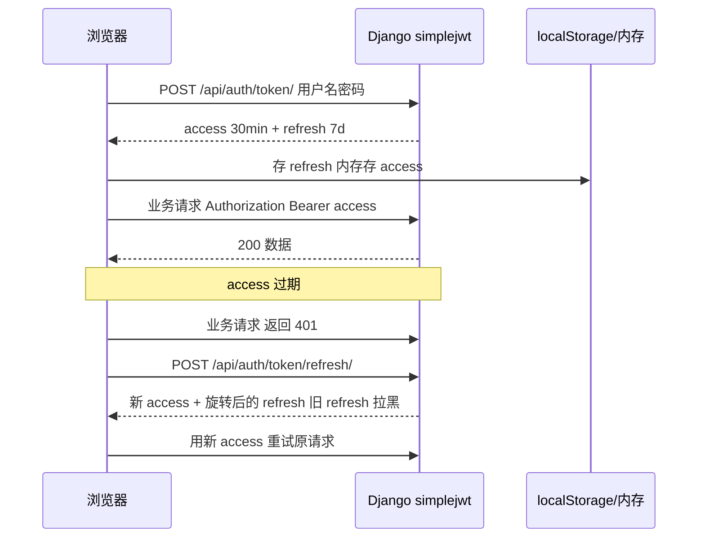
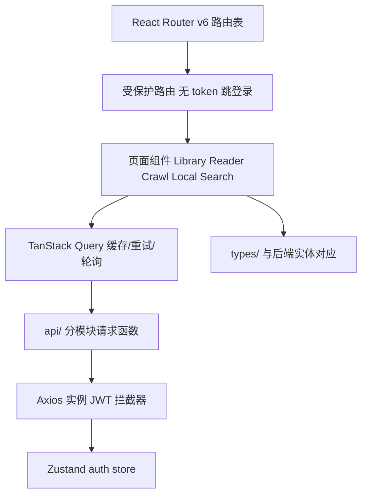

# JM-Website 架构设计

> 配套文档：`docs/plan.md`（实施规划）、`docs/linter.md`（工程化规范）。
> 本文聚焦「系统长什么样」与「数据怎么迁移」。

---

## 1. 系统总览（部署视图）



要点：

- **Nginx 是唯一入口**（对外 8000 端口）：`/` 返回 React 产物，`/api/` 反代到 Django，`/media/` 直接映射磁盘目录。
- **Django 退化为纯 API 服务**：不再渲染任何 HTML 模板。
- **Celery 承担全部爬取/下载**：worker 用线程池，每个任务内部跑独立事件循环驱动异步客户端。
- **Redis 三用**：Django 缓存、Celery broker、Celery result backend（现状保留）。

---

## 2. 请求流转（一次在线阅读为例）



---

## 3. 后端分层架构



分层职责（强制约束，见 `linter.md` 2.2）：

| 层 | 职责 | 禁止 |
| --- | --- | --- |
| `views.py` | 解析请求参数、调用 service、组装响应 | 直接 import jmcomic、写业务逻辑 |
| `serializers.py` | 入参校验、出参序列化 | 发起网络请求 |
| `services/` | 业务编排：缓存、数据库、jmcomic 调用 | 感知 HTTP 请求对象 |
| `services/jm_async.py` | jmcomic 异步客户端唯一入口、异常映射、并发控制 | 直接操作 ORM |
| `models.py` | 数据结构定义 | 业务逻辑 |

---

## 4. 异步爬虫执行模型（核心）



关键设计决策：

1. **一个任务 = 一个事件循环 = 一个异步客户端**：`asyncio.run()` 在 Celery 线程内启动，`async with` 保证客户端离开作用域自动释放连接，无泄漏。
2. **两级并发**：章节级 `asyncio.gather`（默认并发 3，保守保护远端）+ 图片级 `Semaphore`（默认 30，对应 `jm-option.yml` 的 `download.threading.image`）。
3. **ORM 串行化**：所有数据库写操作抽成同步函数，经 `sync_to_async(thread_sensitive=True)` 调用，规避 SQLite 并发写冲突。
4. **断点续传**：每章下载完成即落库 `is_downloaded=True`，重跑任务自动跳过已下载章节（语义与现状一致）。
5. **异常映射**：`MissingAlbumPhotoException`（ID 不存在）→ `RequestRetryAllFailException`（重试耗尽）→ `JsonResolveFailException` → `JmcomicException`（兜底），统一写日志并反映到任务结果。

---

## 5. 认证流程（Session → JWT）



- 注册仍需 `secret_key` 注册密钥（现状保留）。
- 启用 `ROTATE_REFRESH_TOKENS` + 黑名单，降低 token 泄露风险。
- 前端 Axios 拦截器统一处理 401 自动刷新。

---

## 6. 前端架构



- 开发：Vite dev server（5173）代理 `/api`、`/media` → Django（8000）。
- 生产：`vite build` 产物由 Nginx 托管，SPA 回退 `try_files $uri /index.html`。
- 在线阅读器：后端返回 `{url, num}`，前端 Canvas 按 `num` 切割重绘（移植旧 JS 逻辑）。

---

## 7. 数据迁移与兼容性

**结论：几乎零成本，数据库与 media 文件夹都无需任何手工迁移。** 原因是本次重构只改「代码如何读写数据」，不改「数据本身的结构与位置」。

### 7.1 数据库（SQLite）

| 项 | 是否变化 | 说明 |
| --- | --- | --- |
| `Album` / `Photo` 模型 | **不变** | 字段、索引、外键全部保留，`makemigrations` 无新迁移 |
| `user.User` 模型 | **不变** | 密码哈希算法不变，老账号直接可用 |
| SQLite 文件位置 | **不变** | 仍是 `JmWebProject/db/db.sqlite3`，docker 卷 `./JmWebProject/db` 挂载不变 |
| 数据内容 | **不变** | 无需导入导出、无需脚本转换 |

唯一「体感变化」：**登录态**。旧版用 Redis session（`SESSION_ENGINE=cache`），切 JWT 后旧 session 失效，用户首次访问需重新登录一次。这不是数据丢失，只是认证机制切换，密码本身不受影响。

> 若未来想换 PostgreSQL，才需要 `pgloader` / `dumpdata-loaddata` 迁移；本期明确不换（见 plan.md 非目标）。

### 7.2 Media 文件夹

| 项 | 是否变化 | 说明 |
| --- | --- | --- |
| 目录结构 | **不变** | `media/images/jmcomic/<本子>/<章节>/`、`media/images/local/`、`media/videos/` 原样保留 |
| 磁盘文件 | **不变** | 一张图都不动 |
| `Photo.save_path` / `Album.cover_path` | **不变** | 存的仍是相对路径（如 `images/jmcomic/xxx/yyy`） |
| 访问方式 | 仅读取方变化 | 旧：Django 模板拼 `MEDIA_URL`；新：API 返回完整 URL，前端 `` 直接用 |
| docker 卷 | **不变** | `./JmWebProject/media:/app/JmWebProject/media` 挂载照旧 |

也就是说，重构前后 media 目录可以**原封不动**，新代码读取逻辑（`os.path.join(MEDIA_ROOT, save_path)`）与旧代码完全一致。

### 7.3 Redis 缓存

- 缓存键 `jmw-*` 语义不变；缓存本身是易失数据，服务重启自动重建，无需迁移。

### 7.4 迁移操作清单（实际要做的）

```text
1. 备份：cp db/db.sqlite3 db/db.sqlite3.bak（保险起见）
2. 拉取重构后代码，uv sync
3. uv run python manage.py migrate   # 无新迁移，幂等安全
4. 前端 npm run build，docker compose up -d --build
5. 浏览器重新登录一次（JWT 切换导致）
6. 验证：旧本子在 Library 正常显示、旧图片正常加载
```

**风险点**：几乎没有。唯一需要回归验证的是「旧 `save_path` 相对路径 → 新 API URL 拼接」这一环，已在 plan.md 风险表列出，建议阶段 4 用真实旧数据做一次端到端冒烟。

---

## 8. 与现状的差异速览

| 维度 | 现状 | 重构后 |
| --- | --- | --- |
| 前端 | Django 模板渲染 | React SPA（独立构建） |
| 后端接口 | 视图返回 HTML + 少量 JsonResponse | 全量 DRF JSON API |
| 认证 | Session（Redis） | JWT（simplejwt） |
| 爬虫 | 同步客户端 + 线程池 | 异步客户端 + asyncio 两级并发 |
| 任务反馈 | 提交后无进度 | 任务状态接口 + 前端轮询进度 |
| 包管理 | requirements.txt + pip | uv + pyproject + uv.lock |
| 日志 | print | logging（控制台 + 滚动文件） |
| 测试 | 无 | pytest 分层测试 + 覆盖率门禁 |
| 规范 | 无统一约束 | Ruff + pre-commit + CI 门禁 |
