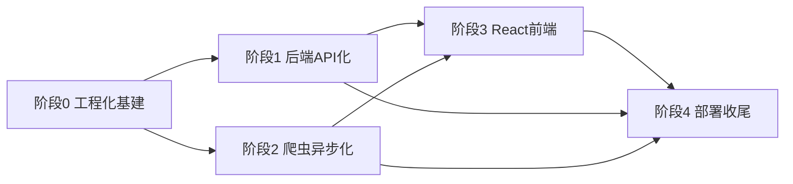

# 开发详细计划与验收标准

> 配套：`plan.md`（总体规划）、`design.md`（架构）、`linter.md`（工程规范）。
> 本文回答两件事：**① 重构后功能是否与现状一致**；**② 怎么一步步开发、每步怎么验收**。

---

## 第一部分：功能一致性核对（Feature Parity）

核对口径：以现状 `comic/urls.py` 全部路由 + `user` 认证 + Celery 任务为基准，逐项确认重构后有对应实现，且**业务行为不变**。

图例：✅ 完全一致 ｜ 🔄 实现方式变但行为一致 ｜ ➕ 重构新增能力

### 1.1 认证模块

| # | 旧功能 | 旧入口 | 新实现 | 一致性 | 差异说明 |
| --- | --- | --- | --- | --- | --- |
| A1 | 注册（密钥校验 + 表单校验 + 自动登录） | `register_view` | `POST /api/auth/register/` | 🔄 | 密钥校验逻辑保留；返回 JWT 而非 session 登录 |
| A2 | 登录 | `LoginView` | `POST /api/auth/token/` | 🔄 | session → JWT，密码验证不变 |
| A3 | 登出 | `LogoutView` | `POST /api/auth/logout/` | 🔄 | refresh token 拉黑 |
| A4 | 登录态保持 7 天 | `SESSION_COOKIE_AGE=604800` | refresh token 7d | ✅ | 时长对齐 |
| ➕ | — | — | `POST /api/auth/token/refresh/` | ➕ | 无感刷新，新增 |

### 1.2 漫画库模块

| # | 旧功能 | 旧入口 | 新实现 | 一致性 | 差异说明 |
| --- | --- | --- | --- | --- | --- |
| L1 | 本子卡片列表（仅含已下载章节、30/页、按 created_at 倒序） | `jm_album_list_view` | `GET /api/library/albums/` | ✅ | 过滤/排序/分页规则完全保留 |
| L2 | 本子详情 + 章节列表（按 sort_index） | `jm_album_detail_view` | `GET /api/library/albums/{id}/` | ✅ | — |
| L3 | 删除本子（删文件夹 + Redis + DB，仅 POST） | `album_delete_view` | `DELETE /api/library/albums/{id}/` | 🔄 | 方法由 POST 改 RESTful DELETE；三步删除逻辑保留 |
| L4 | 检测更新（对比远端 episode_list、返回新章节、更新 Redis + total_episodes） | `check_album_updates_view` | `POST /api/library/albums/{id}/check-updates/` | ✅ | 差集对比逻辑保留 |
| L5 | 本地阅读器（300/页、target 跳转、上/下章导航、自然排序） | `jm_photo_detail_view` | `GET /api/library/photos/{id}/` | ✅ | 分页/跳转/导航参数与计算保留 |

### 1.3 爬取模块

| # | 旧功能 | 旧入口 | 新实现 | 一致性 | 差异说明 |
| --- | --- | --- | --- | --- | --- |
| C1 | 提交爬取（解析输入、派发 Celery、返回 task_id） | `start_crawl_view` | `POST /api/crawl/` | ✅ | `parse_jm_input` 复用 |
| C2 | 下载整本（元数据 + 封面 + 逐章 + 断点续传 + Redis episode 列表） | `crawl_jm_task(album)` | 异步重写 | 🔄 | 行为一致，底层改异步并发 |
| C3 | 下载单章（定位 album + 封面 + 下载） | `crawl_jm_task(photo)` | 异步重写 | 🔄 | 同上 |
| ➕ | — | — | `GET /api/crawl/tasks/{id}/` | ➕ | 任务进度查询，新增（旧版提交后无反馈） |

### 1.4 本地媒体模块

| # | 旧功能 | 旧入口 | 新实现 | 一致性 | 差异说明 |
| --- | --- | --- | --- | --- | --- |
| M1 | 本地图片/视频文件夹列表（读缓存） | `local_media_view` | `GET /api/local/media/` | ✅ | — |
| M2 | 清缓存重扫（POST） | `local_media_refresh_view` | `POST /api/local/media/refresh/` | ✅ | — |
| M3 | 本地图片分页（300/页、jump 跳转） | `local_media_images_view` | `GET /api/local/images/{folder}/` | ✅ | — |
| M4 | 本地视频列表 | `local_media_videos_view` | `GET /api/local/videos/{folder}/` | ✅ | — |
| M5 | 视频 Range 流式播放 | `stream_video_view` | `GET /api/local/stream/{folder}/{file}` | ✅ | Range/206/Content-Type 逻辑原样保留 |
| M6 | 定时扫描本地媒体（5 分钟） | `scan_local_media_task` | 保留 Beat 任务 | ✅ | — |

### 1.5 在线搜索模块

| # | 旧功能 | 旧入口 | 新实现 | 一致性 | 差异说明 |
| --- | --- | --- | --- | --- | --- |
| S1 | 搜索（keyword/tag、分页、缓存 120s、标记本地已下载） | `search_view` | `GET /api/search/` | 🔄 | 底层改异步客户端；缓存/已下载标记保留 |
| S2 | 在线本子详情（更新检测、likes/views/comments、章节列表） | `search_detail_view` | `GET /api/search/albums/{jm_id}/` | ✅ | — |
| S3 | 在线章节列表 | `search_preview_album_view` | `GET /api/search/albums/{jm_id}/episodes/` | ✅ | — |
| S4 | 在线阅读器（scramble_id、num 计算、300/页、target） | `search_preview_photo_view` | `GET /api/search/photos/{photo_id}/images/` | 🔄 | 后端只返 `{url,num}`，Canvas 反混淆移到前端 |

### 1.6 工具与首页

| # | 旧功能 | 新实现 | 一致性 |
| --- | --- | --- | --- |
| U1 | `parse_jm_input` | 保留 `utils.py` | ✅ |
| U2 | `sanitize_filename` | 保留 `utils.py` | ✅ |
| U3 | `natural_sort_key` | 保留 `utils.py` | ✅ |
| U4 | `scan_local_media_folders` | 迁入 `services/local_media.py` | 🔄 |
| H1 | 首页导航 Hub | 前端 `HomePage`（静态导航） | ✅ |

### 1.7 核对结论

- **无功能删减**：旧版 26 项能力全部有对应新实现。
- **行为变化仅 3 类**（均为预期内）：
  1. 认证 session → JWT（A1-A3）；
  2. 删除接口 POST → DELETE（L3，更符合 REST）；
  3. 爬虫同步 → 异步（C2/C3/S1，行为一致、性能提升）。
- **新增 2 项**：任务进度查询（C2➕）、token 刷新（A➕）。
- **唯一需重点回归**：S4 在线阅读器的反混淆逻辑从后端模板 JS 移到前端 Canvas，须用固定 `scramble_id` 做对照测试。

---

## 第二部分：详细开发计划（WBS + 验收标准）

### 2.0 依赖与里程碑总览

- 阶段 0 是地基，必须最先完成。
- 阶段 1、2 可并行（都只依赖阶段 0）。
- 阶段 3 依赖 1、2 的接口契约（可先按约定 mock 并行起步）。
- 阶段 4 收口。

每个任务的验收标准均为**可执行验证**（命令或可观察行为），而非主观描述。

---

### 阶段 0：工程化基建

| 任务 | 内容 | 涉及文件 | 验收标准 |
| --- | --- | --- | --- |
| 0.1 uv 迁移 | 生成 `pyproject.toml`+`uv.lock`，迁移现有依赖，升 Python 3.11+，删 `requirements.txt` | `pyproject.toml`, `uv.lock`, `.gitignore`, `.dockerignore` | `uv sync --group dev` 成功；`uv run python manage.py check` 通过；`requirements.txt` 已删除 |
| 0.2 Ruff 接入 | 配置 lint+format，一次性整改存量 | `pyproject.toml`, 全部 `.py` | `uv run ruff check .` 零告警；`uv run ruff format --check .` 零差异 |
| 0.3 日志落地 | 重写 `LOGGING`，替换全部 `print`，select 加 `T201` | `settings.py`, `views.py`, `tasks.py` | 全仓 `grep -rn "print(" JmWebProject` 仅剩允许豁免；`ruff check` 含 T201 通过；运行产生 `logs/jmweb.log` |
| 0.4 pytest 框架 | 建 `tests/`，配置 pytest，写纯函数测试 | `tests/conftest.py`, `tests/comic/test_utils.py`, `pyproject.toml` | `uv run pytest` 全绿；`parse_jm_input`/`sanitize_filename`/`natural_sort_key` 覆盖率 100% |
| 0.5 pre-commit | 配置 ruff hook | `.pre-commit-config.yaml` | `uv run pre-commit run --all-files` 通过 |
| 0.6 CI 更新 | 切 uv，加 ruff format check + pytest | `.github/workflows/ci.yml` | CI `check` job 全绿（含 ruff/pytest/migrate） |

**阶段 0 里程碑验收**：`ruff check` + `ruff format --check` + `pytest` + `manage.py check` 四项本地全绿，CI 同步全绿。

---

### 阶段 1：后端 API 化（爬虫暂仍同步，保证行为不变）

| 任务 | 内容 | 涉及文件 | 验收标准 |
| --- | --- | --- | --- |
| 1.1 框架配置 | 引入 DRF/simplejwt/cors，写 settings | `settings.py`, `pyproject.toml` | `manage.py check` 通过；`/api/auth/token/` 路由可访问 |
| 1.2 认证 API | register/token/refresh/logout | `user/views.py`, `user/serializers.py`, `user/urls.py` | API 测试：错误密钥注册 400；正确注册返 JWT；token 刷新旋转且旧 refresh 拉黑 |
| 1.3 序列化器 | Album/Photo/搜索/本地媒体 | `comic/serializers.py` | 序列化单测：字段与 design 5.4 实体一致 |
| 1.4 Library API | L1-L5 五个端点 | `comic/views.py`, `comic/services/library.py`, `comic/urls.py` | API 测试：列表分页/排序正确；删除后文件+DB 均消失；check-updates 返回差集 |
| 1.5 Crawl API | 提交 + 任务状态查询 | `comic/views.py`, `comic/urls.py` | 提交返 task_id；`GET tasks/{id}` 返回合法状态枚举 |
| 1.6 Local API | M1-M5 | `comic/views.py`, `comic/services/local_media.py` | 图片分页/jump 正确；视频流 Range 请求返 206 + 正确 Content-Range |
| 1.7 Search API | S1-S4 | `comic/views.py` | 搜索缓存 120s 命中；已下载标记正确；阅读器返 `{url,num}` |
| 1.8 删除模板 | 移除 templates/static css | `comic/templates/`, `user/templates/`, `templates/`, `static/css/` | 全仓无 `render(` 调用；`manage.py check` 通过 |
| 1.9 API 测试补齐 | 全端点 200/400/401/404/405 | `tests/comic/*`, `tests/user/*` | 覆盖率 ≥70%；未认证访问业务接口返 401 |

**阶段 1 里程碑验收**：用 HTTPie/curl 走通「注册→登录→搜索→提交爬取→查库」全链路；`pytest` 全绿且覆盖率达标；旧模板目录已删除。

---

### 阶段 2：爬虫异步化

| 任务 | 内容 | 涉及文件 | 验收标准 |
| --- | --- | --- | --- |
| 2.1 异步客户端封装 | 客户端工厂、异常映射、并发下载 | `comic/services/jm_async.py` | 单测（mock AsyncJmApiClient）：并发数受 Semaphore 限制；四类异常正确映射 |
| 2.2 tasks 重写 | asyncio.run 入口、ORM sync_to_async 桥接、进度上报、logger | `comic/tasks.py` | EAGER 模式测试：album/photo 两路径成功；已下载章节被跳过；进度 meta 含 current/total |
| 2.3 查询类异步化 | search/detail 改 async_to_sync | `comic/views.py` 或 services | 搜索/详情接口功能测试仍全绿 |
| 2.4 异步测试 | mock 客户端覆盖下载/异常/续传 | `tests/comic/test_services_jm_async.py`, `test_tasks.py` | service 层覆盖率 ≥85%；异常路径有对应用例 |
| 2.5 基准对比 | 同一 album 同步 vs 异步耗时 | PR 描述 | 记录耗时数据；查询类提速 ≥30% 或给出说明 |

**阶段 2 里程碑验收**：手工触发一次真实 album 下载与一次 photo 下载均成功落盘；`pytest` 全绿；日志中无 print、异常有堆栈。

---

### 阶段 3：React 前端

| 任务 | 内容 | 涉及文件 | 验收标准 |
| --- | --- | --- | --- |
| 3.1 脚手架 | Vite+React+TS+Tailwind+Router+Query+Zustand+Axios | `frontend/` | `npm run dev` 启动；`tsc --noEmit` 零错误 |
| 3.2 API 层 + 认证 | client 拦截器、auth store、受保护路由 | `frontend/src/api/`, `stores/`, `App.tsx` | 无 token 访问受保护页跳 /login；401 自动刷新重试 |
| 3.3 页面实现 | Login/Register/Home/Library/AlbumDetail/Reader/Crawl/Local*/Search* | `frontend/src/pages/` | 每个页面对应旧模板功能可用（对照 1.1-1.6） |
| 3.4 反混淆阅读器 | Canvas 按 num 切割重绘 hook | `frontend/src/hooks/useDescrambleImage.ts` | 固定 scramble_id 单测断言切割参数与旧 JS 一致 |
| 3.5 任务进度 | Crawl 页轮询任务状态 + 进度条 | `CrawlPage.tsx` | 提交后进度条随 current/total 更新；完成后刷新 library |
| 3.6 联调构建 | vite 代理联调 + 生产构建 | `vite.config.ts` | `npm run build` 成功；`npm run lint` 零告警 |

**阶段 3 里程碑验收**：所有旧页面功能在新 SPA 可用；ESLint + tsc 零报错；生产构建产物可被 nginx 托管。

---

### 阶段 4：部署收尾

| 任务 | 内容 | 涉及文件 | 验收标准 |
| --- | --- | --- | --- |
| 4.1 前端 Dockerfile | node 构建多阶段 | `frontend/Dockerfile` | 镜像构建成功，产物含 `dist/` |
| 4.2 compose + nginx | 前端服务、SPA 回退、/api 反代、日志卷 | `docker-compose.yml`, `nginx/default.conf` | `docker compose config` 通过；`/` 返 SPA、`/api/` 反代、`/media/` 直出 |
| 4.3 文档同步 | README/setup/.env.example | 相应文件 | 启动步骤与新增变量一致 |
| 4.4 CI 前端 job | npm ci + lint + build | `.github/workflows/ci.yml` | 前端 job 全绿 |
| 4.5 端到端回归 | 真实旧数据全链路冒烟 | — | 旧本子显示、旧图片加载、搜索、爬取、阅读全部正常 |

**阶段 4 里程碑验收（项目总验收）**：`docker compose up -d --build` 一键启动；用**真实旧数据库 + 旧 media** 完成「注册→登录→搜索→爬取新本→阅读旧本→播放本地视频」全链路；CI 全绿。

---

## 第三部分：建议开发顺序与节奏

1. **第 1 步**：阶段 0 全量完成（地基，约 6 个子任务）。
2. **第 2 步**：阶段 1、2 并行推进（后端 API 与异步爬虫互不阻塞）。
3. **第 3 步**：阶段 1 接口契约稳定后，阶段 3 前端起步（可先 mock）。
4. **第 4 步**：阶段 4 收口 + 真实数据回归。

> 每个阶段结束执行对应「里程碑验收」，全绿才进入下一阶段。每完成一个子任务即跑一次相关测试，避免问题堆积。
